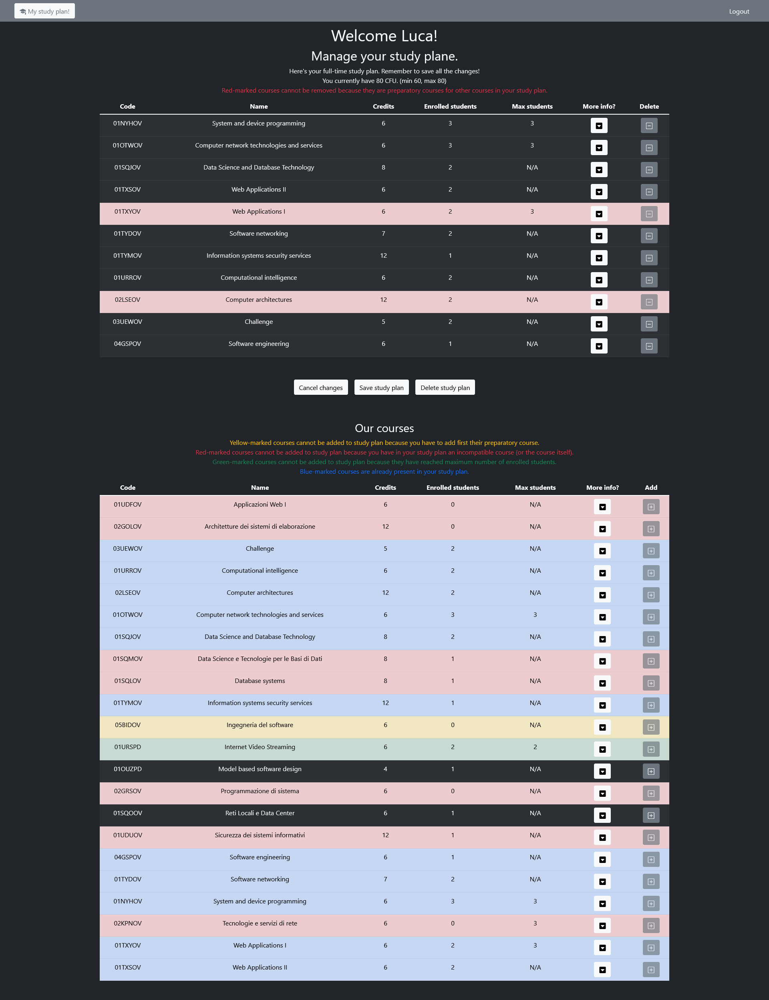

# Exam #1: "StudyPlan"
## Student: s303976 Scibetta Luca 

## React Client Application Routes

- Route `/`: main page visible before logging in
- Route `/login`: page containing the login form
- Route `/profile`: page containing the personal page of a user visible after login, from this page users can view and manage their own study plan
- Route `#`: default page loaded in case of unexisting URLs

## API Server

- GET `/api/sessions/current`
  - request parameters: credentials for passport authentication
  - response body: user info
  - response status: 200 success, 401 not authenticated
- POST `/api/sessions`
  - request parameters: credentials for passport authentication, content-type application/json
  - request body: credentials
  - response body: user info
  - response status: 201 successful login, 401 wrong credentials
- DELETE `/api/sessions/current`
  - request parameters: credentials for passport authentication
  - response body: none
  - response status: 200 successful logout
- GET `/api/courses`
  - request parameters: none
  - response body: list of all courses ordered in alphabetical order respect to course name
  - response status: 200 success, 500 database errors
- GET `/api/users/time`
  - request parameters: credentials for passport authentication
  - response body: user study plan time
  - response status: 200 success, 400 wrong credentials, 500 database error
- PUT `/api/users/time`
  - request parameters: credentials for passport authentication, content-type application/json
  - request body: study plan time (string with possible values 'part' or 'full')
  - response body content: success message
  - response status: 200 success, 400 wrong credentials, 404 user not exists, 409 user has a valid study plan with courses already in it, 422 validation of study plan time failed, 503 database error
- GET `/api/studyplans`
  - request parameters: credentials for passport authentication
  - response body: list of courses in user study plan
  - response status: 200 success, 400 wrong credentials, 500 database error
- POST `/api/studyplans`
  - request parameters: credentials for passport authentication, content-type application/json
  - request body: list of course codes of user new study plan
  - response body: success message
  - response status: 201 success, 400 wrong credentials, 404 study plan (time) not found, 409 violated study plan constraints, 422 validation of request body failed or unexisting course code in request body, 503 database error
- DELETE `/api/studyplans`
  - request parameters: credentials for passport authentication
  - response body: success message
  - response status: 204 success in deletion or study plan already not existing, 400 wrong credentials, 503 database error

## Database Tables

- Table `user` - contains id, username, name, hash (hashed password), salt (for hsahing password), studyPlan (study plan time of user study plan, null if user does not have a study plan)
- Table `course` - contains code, name, credits, maxStudents (maximum number of students that can enroll to the course at the same time), enrolledStudents (amount of students currently enrolled), preparatoryCourse (code of a course that the current course needs as preparatory), incompatibleWith (string with codes of courses incompatible with the current one separated with single space)
- Table `userCourse` - bridge table used to represent study plans of users, contains userId (id of a user), courseCode (code of a course of user study plan)

## Main React Components

- `LoginForm` (in `AuthComponents.js`): show a form for inserting credentials (username and password) for login, on sumit (login) it validates inserted data before sending the request to the server
- `MyCourseTable` (in `MyCourseTable.js`): used for showing all the course tables in the app, calls CourseRow component to visualize each course in the table
- `CourseRow` (in `MyCourseTable.js`): shows a row representing a course in a table, provides different visualizations and functionalities depending on the props it receives; in the main table of courses (before login or before user have created a study plan) simply shows courses information with the possibility to expand the current row for more details about the course; in the table shown if the user have created a study plan also a button is present that allows user to insert a course in the study plan, if necessary it disables the possibility to add a course to study plan also marking the row with a different color depending on the cause of the disabling; in the table representing the user study plan there is a button to remove a course from the study plan, the button can be disabled if the removing would cause violating a preparatory course constraint, in this case the row is marked in red
- `CourseData` (in `MyCourseTable.js`): shows some course information and the button to expand the row, if necessary shows also the button to add or remove a course to/from the study plan, the button may be disabled and in this case the row will be marked with different possible colors
- `MyNavbar` (in `MyNavbar.js`): shows the navbar, the navbar always have a navlink that redirects user to the main page (before login) or to the profile page (after login), then there may be another navlink that redirect user to the page with login form or a button to perform logout
- `UserView` (in `Views.js`): manage the visualization of the main page for logged users, optionally there is an alert to inform user of possible errors, if user has not yet a study plan it can create one by choosing between part-time and full-time, if user has already a study plan it is shown a table with sutdy plan information but only if thee study plan of the user is not empty and also three buttons are shown to allow user to cancel the temporary changes, save them or delete the entire study plan, finally it is always shown a table with information of all courses and the possibility to add them to the study plan if no constraint is violated

Minor components (`CourseDescription` and the other views in `Views.js`) are considered too simple and do not need further information.

## Screenshot

## Users Credentials

- username: luca@polito.it, password: passwordLuca, full-time study plan
- username: alice@polito.it, password passwordAlice, part-time study plan
- username: kevin@polito.it, password passwordKevin, part-time study plan
- username: valeria@polito.it, password passwordValeria, full-time study-plan
- username: romina@polito.it, password passwordRomina, no study plan
- username: pietro@polito.it, password passwordPietro, no study plan